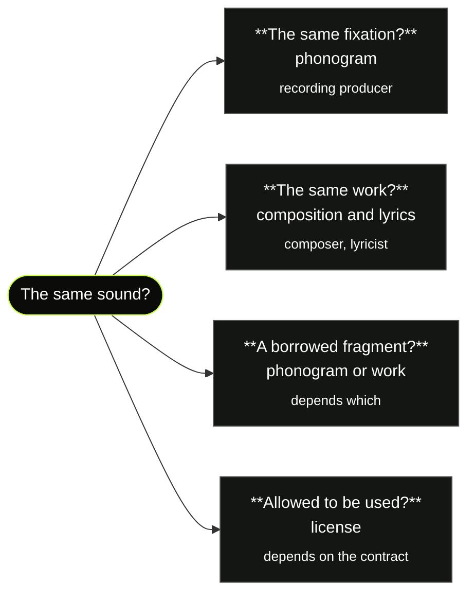
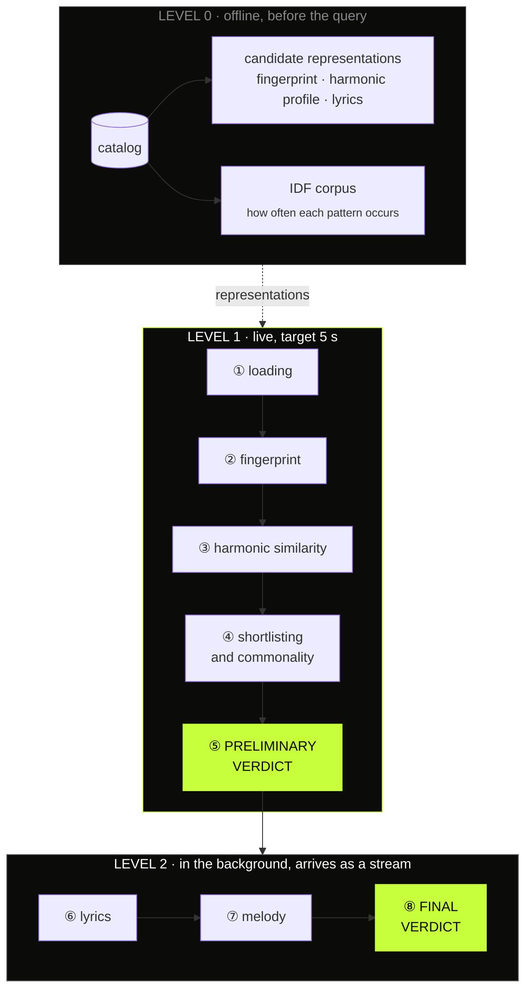
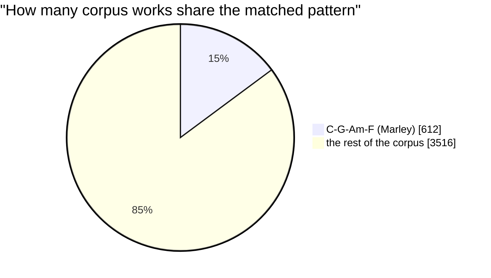
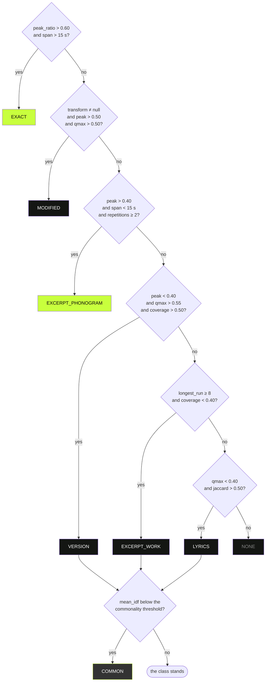

<p align="center">
  
</p>

<h1 align="center">GRAI ORIGIN</h1>
<p align="center"><b>PROVENANCE ENGINE</b><br>
<sub>GRAI x VIBESTARS / CASE 03</sub></p>

<p align="center">
You paste the address of a recording. The system tells you where that sound comes from<br>
and <b>what kind</b> of similarity it is.
</p>

---

## Why "what kind", not "how much"

The question "does this sound infringe someone's rights" breaks apart into four
different questions. Each has a different answer, a different method and a
different rightholder.



A tool that returns a single similarity number answers none of them. That is why
the result of GRAI ORIGIN is an **evidence class**, and the number is merely its
confidence.

| Class | Means | Example |
|:--|:--|:--|
| `EXACT` | the same fixation | reupload, rip, trim |
| `MODIFIED` | the same fixation, altered | speedup, nightcore, pitch shift |
| `VERSION` | the same work, a different performance | cover, live version |
| `EXCERPT_PHONOGRAM` | a borrowed fragment of the recording | sample, loop |
| `EXCERPT_WORK` | a borrowed phrase of the composition | the same melody, a different recording |
| `LYRICS` | lyrical overlap only | translation, reworking |
| `COMMON` | **an element common to the genre** | a commonplace chord progression |
| `NONE` | no match | |

> **`COMMON` is a result of its own, not a variant of no match.** The system is
> meant to say it outright: *we found a similarity and we believe it is not
> material*. That one class separates a useful tool from a false-alarm generator.

---

## The flow: what happens after you paste an address

The work splits into three execution levels. Not by detector, but by **when**
something is allowed to happen.



**The verdict appears after level 1 and grows in front of the viewer.** For the
pitch: *the verdict in five seconds, the evidence arriving over the next thirty.*

The overriding rule: heavy models (source separation, transcription) **never**
touch the full candidate set. Queries and shortlists only. That is the only reason
this works on a million recordings.

---

## Eight steps, one after another

Each step below has three parts: **what this piece of the engine does**, **what
that gives you when comparing against the database** and **illustrative figures
from the demo scenario** in which we paste Aretha Franklin singing "Let It Be".

Those figures are illustrative, not measured: they come from the demo scenario
written before the engine existed, and they show what a hit looks like on
screen. For numbers that were actually measured on real audio - including the
real run of this exact example, which came out very differently - see
[`walkthrough.md`](walkthrough.md) and [`full-run.md`](full-run.md).

### ① Loading

<table><tr><td width="50%">

**What it does.** Downloads the track, brings it to mono 22,050 Hz, normalizes
loudness to **-23 LUFS** per the BS.1770-4 standard, trims silence at the edges,
cuts it into ten-second windows with half overlap.

**What that gives.** The query arrives in exactly the same form in which we hold
every entry in the database. Without that, the same energy threshold would mean
something different for a vinyl rip and a studio master. It is the equivalent of
normalizing text before indexing documents.

</td><td>

```
duration     169.4 s
windows      34
sha256       b47e0a91c8f3...
```

Loudness measurement is anchored to the standard: a 1 kHz sine at full scale reads
**-3.0036 LKFS** against the reference -3.01.

</td></tr></table>

### ② Acoustic fingerprint

<table><tr><td width="50%">

**What it does.** Turns spectral maxima into hashes from triplets `(f1, f2, dt)`
and **looks them up in an inverted index** spanning the whole database, exactly the
way a search engine looks words up in a document index. For each candidate it
computes a histogram of time offset differences.

**What that gives.** The cost does not grow with the size of the database, because
this is a dictionary lookup rather than a scan. And the histogram settles, along
the way, whether the hit is genuine:

</td><td>

```
hashes            4 477
matched  cand_07     52
peak_ratio         0.07   ← noise
```

Aretha is a different recording from the Beatles one, so the fingerprint
**rightly does not hit**. The noise floor is 0.25.

```mermaid
xychart-beta
    title "Histogram of offset differences: a hit versus chance"
    x-axis "time offset" ["-4s","-3s","-2s","-1s","0","+1s","+2s","+3s","+4s"]
    y-axis "matching hashes" 0 --> 420
    bar "reupload (EXACT)" [6, 9, 7, 11, 412, 8, 5, 10, 6]
    bar "chance" [44, 51, 48, 39, 55, 47, 42, 50, 46]
```

</td></tr></table>



**A true hit gives a sharp spike, chance gives a flat distribution.** The same
chart is simultaneously the proof and the pointer to which second holds the shared
fragment. This is the picture a jury understands in a second.

### ③ Harmonic similarity

<table><tr><td width="50%">

**What it does.** Computes a profile of twelve pitch classes over time (a
chromagram) and compares it by **cumulative alignment along diagonals** (Qmax),
checking all twelve transpositions and taking the best.

**What that gives.** It finds the same work played in a different key, at a
different tempo and in a different arrangement, that is where the fingerprint stays
silent. Ahead of the expensive matrix, every entry in the database has a
**256-dimensional vector** computed and compared by cosine, as in semantic search.
The matrix is computed only for the twenty nearest.

</td><td>

```
cand_07  Let It Be / Beatles
  qmax_score      0.82   ← hit
  coverage        0.78
  transposition   +3 semitones
  tempo_ratio     0.93

cand_08  No Woman, No Cry / Marley
  qmax_score      0.66   ← also hits!
  coverage        0.61
```

</td></tr></table>

Two decisions that are counterintuitive, and both are deliberate:

- **We do not detect the key.** Key detection is unreliable, and its error would
  propagate into the whole result. Twelve rotations and a maximum give the answer
  "transposed by +3" for free.
- **A diagonal path, not correlation.** A cover has a different tempo, so the match
  is tilted and ragged. Correlation does not see that.

Note `cand_08`: **Marley hits too**, and strongly. That is the problem the next
step solves.

### ④ Shortlisting and commonality

<table><tr><td width="50%">

**What it does.** Counts in how many entries of the reference corpus the matched
pattern occurs, and weights the score by it: `idf(w) = log(N / df(w))`. That is
**inverse document frequency**, the same mechanism that in a search engine tells a
meaningful word apart from a conjunction.

**What that gives.** With a database counted in millions **everything matches
something**, because a popular progression sits in tens of thousands of works. This
step tells borrowing apart from genre convention and is the only reason the results
can be used without drowning a lawyer in them.

</td><td>

```
cand_07  Let It Be
  chord_seq   C G Am F C G F C
  mean_idf         7.9   ← rare
  corpus_freq        6

cand_08  No Woman, No Cry
  chord_seq   C G Am F
  mean_idf         1.4   ← commonplace
  corpus_freq      612  of 4128
```

</td></tr></table>

Both works share the **C-G-Am-F** progression. But with the Beatles the whole
eight-chord sequence hit, and it occurs in 6 works of the corpus. With Marley only
four chords hit, and they occur in **612**. That is not a borrowing, that is a
convention.



### ⑤ Preliminary verdict

<table><tr><td width="50%">

**What it does.** A rule tree with explicit conditions, checked **in a fixed
order**, the first one satisfied wins. It uses the fingerprint and harmonic
similarity only, that is what could be computed against the whole database in a few
seconds.

**What that gives.** An answer before the slower evidence arrives. And because the
tree is auditable, it is possible to show **which condition decided**. In a legal
application that is not a luxury but a condition of usefulness.

</td><td>

```
cand_07 → VERSION       0.73  raw
cand_08 → VERSION → COMMON
          degraded: mean_idf 1.4
          below the commonality threshold
```

</td></tr></table>



> **Degradation to `COMMON` applies to the work layer only.** Never `EXACT`,
> `MODIFIED` or `EXCERPT_PHONOGRAM`. A reupload of a work built on a commonplace
> progression does not stop being a reupload, because fingerprint hashes are not
> genre patterns.

### ⑥ Lyrics

<table><tr><td width="50%">

**What it does.** Transcribes the vocal and compares **five-word shingles with
MinHash signatures**, a technique for detecting duplicates in large document
collections. Plus sentence embeddings for translations and paraphrases. A
**confidence gate** rejects an unreliable transcription, and only then triggers
source separation.

**What that gives.** Candidate lyrics are taken ready-made, so the database needs no
processing at all, and the whole cost is a single query recording. The gate tells
**absence of lyrics apart from not having checked**: a speech recognition model
hallucinates on an instrumental.

</td><td>

```
pass 1  on the full mix
  asr_confidence   0.36  ← REJECTED
  → source separation (demucs)
pass 2  on the separated vocal
  asr_confidence   0.82  ← OK
  words             52

cand_07  jaccard 0.71  semantic 0.89
cand_08  jaccard 0.09  semantic 0.74
```

</td></tr></table>

Whisper runs **on the full mix first**, and demucs only after the gate rejects the
result. That turns the fixed cost of the most expensive operation into a
conditional cost. On screen you see the moment when the system judges its own
confidence rather than merely computing.

### ⑦ Melody

<table><tr><td width="50%">

**What it does.** Transcribes the melodic line into symbolic form and compares
**interval sequences**, not absolute pitches, indexing them the way phrases in text
are indexed. Plus the Mongeau-Sankoff distance, which understands that a melody
played with ornaments is still the same melody.

**What that gives.** Invariance to transposition and arrangement, and a number a
musicologist and a lawyer both understand: **how many consecutive intervals are
identical**. It is the only detector operating on what the law regards as the
creative element of a work.

</td><td>

```
[60,62,64,65]  →  [+2,+2,+1]
[67,69,71,72]  →  [+2,+2,+1]   the same

cand_07  longest_common_run  12
         ms_distance       0.14
cand_08  longest_common_run   3
         ms_distance       0.58
```

</td></tr></table>

### ⑧ Final verdict

<table><tr><td width="50%">

**What it does.** The slower evidence joins the evidence from the first level and
the tree recomputes the class and the confidence again, on the full set of signals.
Calibration (logistic regression on labeled pairs from the catalog) turns the raw
score into a probability that can be checked.

**What that gives.** The verdict may change, and that is a feature, not a defect.
You can see the system upgrading its own answer as it gets more data.

</td><td>

```
cand_07  VERSION
         0.73 → 0.96
         The Beatles, 1970-03-06
         ↗ youtube.com/watch?v=CGj85pVzRJs

cand_08  COMMON
         pattern in 612 works
```

</td></tr></table>

---

## The result on screen

Same demo scenario, so the same illustrative figures.

```
┌──────────────────────────────────────────────────────────────────┐
│  ▎THE SAME WORK                                 confidence 0.96  │
│                                                                  │
│  Let It Be                                                       │
│  The Beatles · 1970-03-06                                        │
│  ↗ youtube.com/watch?v=CGj85pVzRJs                               │
│                                                                  │
│  Harmony and lyrics match, the fingerprint does not hit:         │
│  this is the same work in a different performance.               │
├──────────────────────────────────────────────────────────────────┤
│  2. No Woman, No Cry · Bob Marley        COMMON ELEMENT          │
│     this pattern occurs in 612 works in the corpus               │
└──────────────────────────────────────────────────────────────────┘
```

A sentence worth saying at the second entry: *most tools will show a match here.
This is the only one that can say it is immaterial, and explain why.*

---

## Why this scales

| Operation | How many times per query | Depends on database size |
|:--|:--|:--|
| Source separation, speech and melody transcription | once, on the query | **no** |
| Full harmonic similarity matrix | at most 20 | **no** |
| Hash lookup in the index | a few thousand | sublinearly |
| 256-dimensional vector comparison | once per candidate, vectorized | linearly, seconds for millions |

**The cost of the heavy part is constant regardless of whether the database holds a
thousand entries or ten million.** Growing the catalog is a one-off, offline,
parallelized cost.

And the most important sentence about scale: **at a million recordings, finding
things stops being the problem.** Everything matches something. The bottleneck is
not detection, it is not drowning in the results. That is why the commonality
filter and calibration are not ornaments but a condition of deployment.

---

## The legal layer: a signal, not a ruling

The system returns **flags and an evidence classification, never a ruling on
infringement**. It is triage for a legal team, not a machine handing down
judgments.

| Legal criterion | Source | Technical signal |
|:--|:--|:--|
| Recognizability of the sample to the ear | Pelham I, CJEU C-476/17 | `recognizability` from `peak_ratio` |
| Perceptible difference | Pelham II, CJEU C-590/23 | `modification` from the tempo and key shift |
| Recognizable artistic dialogue | Pelham II | **not measured** |
| Inspiration is not a derivative work | art. 2(4) of the Act | commonality filter, the `COMMON` class |

Of the three conditions for pastiche we **measure two, and the third we do not
measure and will not measure**. The system also does not settle the question of
access: similarity without showing that the author could have known the earlier
work is not enough. Chronology is circumstantial.

---

## What we do not know

Required by the brief, and better said unprompted.

**Our thresholds are calibrated on covers, because that is the data we got.** We do
not know whether they hold up on samples and remixes, and that is precisely where
the legal stakes are highest. Next step: a labeled set of samples and a separate
calibration for the fragment class.

**The reference catalog itself makes a mistake our system can catch.** It has no
work identifier, only the title as a string, so Elvis's "Hurt" from 1954 and Nine
Inch Nails' "Hurt" from 1994 sit in one group as the same work. The system listens
to sound instead of reading labels, so it will say those are two different
compositions. And it will be right against its own database.

<p align="center"><sub>GRAI ORIGIN / CASE 03 / HOW IT WORKS</sub></p>
